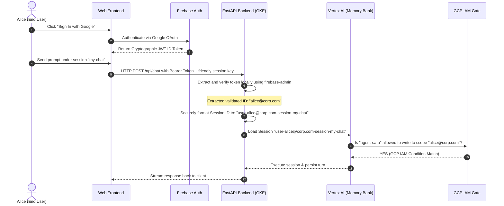

# Multi-User Session-Isolated Agent (Firebase + FastAPI + ADK)

This folder contains an end-to-end implementation of a stateful, multi-user AI agent that guarantees complete session and memory isolation. 

Instead of relying on a single shared workspace, it secures the backend by validating **Firebase Identity Tokens (JWT)** and prefixing memory sessions. It also leverages GCP IAM conditions on the Memory Bank as an absolute safety net.

---

## 1. Architecture Design

The diagram below illustrates how end-to-end token verification and session isolation are enforced across our components:



---

## 2. Components Directory

- **`frontend/index.html`**: A premium, glassmorphic client interface containing full Google Sign-In via Firebase Auth. It acquires the JWT token and transmits it to our backend.
- **`agent/main.py`**: A robust FastAPI backend service that decodes tokens, maps session IDs securely, and manages ADK sessions under isolated memory scopes.
- **`agent/Dockerfile`**: A Docker configuration to package and serve the FastAPI application on port 8080.
- **`deployment/multi-user-agent.yaml`**: The GKE deployment and LoadBalancer Service manifest to run and expose the API.

---

## 3. Step-by-Step Implementation Guide

### Phase 1: Configure Firebase Authentication

1.  **Create a Firebase Project**:
    Go to the [Firebase Console](https://console.firebase.google.com/) and create a project matching your GCP project: `GCP_PROJECT_ID`.
2.  **Enable Google Sign-In**:
    *   Navigate to **Build > Authentication > Sign-in method**.
    *   Click **Add new provider** and select **Google**.
    *   Enable it, choose a project support email, and save.
3.  **Get Client SDK Configuration**:
    *   Go to **Project Settings** (gear icon) > **General**.
    *   Under **Your apps**, click the web icon (`</>`) to register a new Web App.
    *   Copy the `firebaseConfig` object and replace the placeholder config on **lines 305–315** inside [frontend/index.html](frontend/index.html):
        ```javascript
        const firebaseConfig = {
            apiKey: "YOUR_REAL_API_KEY",
            authDomain: "GCP_PROJECT_ID.firebaseapp.com",
            projectId: "GCP_PROJECT_ID",
            storageBucket: "GCP_PROJECT_ID.appspot.com",
            messagingSenderId: "...",
            appId: "..."
        };
        ```

---

### Phase 2: Build and Push the Backend Image

Build the secure FastAPI container using Google Cloud Build and save it to your Artifact Registry:

```bash
# Set your variables
PROJECT_ID="GCP_PROJECT_ID"
REGION="us-central1"

# Trigger Cloud Build
gcloud builds submit agent/ \
    --config=agent/cloudbuild.yaml \
    --substitutions=_DESTINATION="$REGION-docker.pkg.dev/$PROJECT_ID/agent-repository/multi-user-isolated-agent:latest"
```

---

### Phase 3: Deploy to GKE and Expose the API

Deploy the workload to the secure GKE cluster. The container runs under Workload Identity using the verified Google Service Account (`agent-sa-a`):

```bash
# Deploy to Kubernetes
kubectl apply -f deployment/multi-user-agent.yaml

# Monitor deployment progress
kubectl get pods -n namespace-a -w
```

Once the pod is ready, query the service to obtain the public LoadBalancer IP:
```bash
kubectl get service adk-multi-user-service -n namespace-a
```

*Copy the **EXTERNAL-IP** returned by GKE (e.g., `35.224.23.45`).*

---

### Phase 4: Spin Up the Local Web Client

1.  Open the [frontend/index.html](frontend/index.html) file locally or serve it using a lightweight server:
    ```bash
    python3 -m http.server 9000
    ```
2.  Open `http://localhost:9000` in your web browser.
3.  Click **Sign In with Google** and complete the OAuth login flow.
4.  Once logged in, paste your **EXTERNAL-IP** (e.g., `http://35.224.23.45` or `http://localhost:8080` if running locally) into the **Backend Service URL** field.
5.  Type your friendly session key and start chatting!

---

### Phase 5: Apply Least-Privilege GCP IAM CEL Conditions

To enable Layer 2 security, you must enforce execution constraints and memory scope locks for your users (e.g., Alice and Bob) via **GCP Common Expression Language (CEL)**:

#### 1. Define Standalone CEL Condition Files
Create a local YAML file named `alice-memory-cond.yaml` containing the memory scope lock:
```yaml
title: AliceMemoryScopeLock
description: Restrict memory storage accesses strictly to Alice's user scope
expression: "api.getAttribute('aiplatform.googleapis.com/memoryScope', {})['userId'] == 'alice@yourdomain.com'"
```

Create another YAML file named `alice-engine-cond.yaml` containing the reasoning engine execution limit:
```yaml
title: RestrictAliceToCasperEngine
description: Only allow Alice to execute the specific Casper reasoning engine
expression: "resource.type == 'aiplatform.googleapis.com/ReasoningEngine' && resource.name == 'projects/GCP_PROJECT_ID/locations/us-central1/reasoningEngines/REASONING_ENGINE_ID_A'"
```

#### 2. Execute gcloud Bindings
Run these commands to apply the CEL-conditioned roles to Alice's Google Account:

```bash
# A. Apply Alice's execution constraint role
gcloud projects add-iam-policy-binding GCP_PROJECT_ID \
    --member="user:alice@yourdomain.com" \
    --role="roles/aiplatform.user" \
    --condition-from-file=alice-engine-cond.yaml

# B. Apply Alice's isolated memory scope lock role
gcloud projects add-iam-policy-binding GCP_PROJECT_ID \
    --member="user:alice@yourdomain.com" \
    --role="roles/aiplatform.memoryUser" \
    --condition-from-file=alice-memory-cond.yaml
```

*(Repeat this process for Bob, replacing the email with `bob@yourdomain.com` inside his corresponding YAML files and commands.)*

---

## 4. Why this Implementation is Airtight (Multi-Tenant Session & Memory Isolation)

Our architecture secures stateful memory banks across both application and cloud resource boundaries, achieving a **Defense-in-Depth** pattern.

### A. The ADK Session ID Mapping Flow
A common vulnerability in naive LLM frameworks is that any user can guess another tenant's session key. We resolve this by logically mapping every request on the FastAPI backend using **Google OIDC Token Delegation**:

1. **OIDC Token Verification:** The FastAPI backend intercepts the `Authorization: Bearer` header, queries Google's Token Info service, and retrieves the verified email (e.g., `alice@yourdomain.com`).
2. **Strict Sanitization (Dashes & Lowercase):** The local Python ADK library permits underscores and uppercase letters, but the live Vertex AI REST API Gateway strictly requires resource sub-paths to match the naming convention `^[a-z0-9-]+$`. Therefore, the backend sanitizes both the email and the friendly key by converting all non-alphanumeric characters to dashes (`-`) and forcing lowercase:
   ```python
   sanitized_user = re.sub(r'[^A-Za-z0-9-]', '-', user_id).lower()
   # 'alice@yourdomain.com' -> 'alice-yourdomain-com'

   sanitized_key = re.sub(r'[^A-Za-z0-9-]', '-', request.session_key).lower()
   # 'my-secrets' -> 'my-secrets'
   ```
3. **Structured ID Construction:** These parts are joined to construct the underlying **ADK `session_id`**:
   ```python
   secured_session_id = f"user-{sanitized_user}-session-{sanitized_key}"
   # Result: "user-alice-yourdomain-com-session-my-secrets"
   ```

Because of this logical prefix, Alice is always routed to her own isolated session, even if both Alice and Bob type `default-chat` as their session key in the sidebar.

---

### B. OIDC User Token Delegation & GCP IAM (Infrastructure Fallback)
Even if there is a severe application bug or a malicious attacker gains shell execution inside the GKE container and attempts to fetch other users' memory databases directly via Vertex AI's REST APIs, they are blocked by **Layer 2 (GCP IAM CEL Conditions)**.

Instead of GKE making database calls using a highly-privileged shared Service Account, the backend instantiates the ADK `Runner` passing **Alice's delegated OIDC credentials**:
```python
session_service = DelegatedVertexAiSessionService(..., credentials=user_creds)
model = DelegatedGemini(..., credentials=user_creds)
```

As a result, all downstream requests hit Vertex AI directly under Alice's identity. Google Cloud IAM evaluates the **CEL (Common Expression Language)** condition on her `Vertex AI Memory User` role:
```cel
api.getAttribute('aiplatform.googleapis.com/memoryScope', {})['userId'] == 'alice@yourdomain.com'
```

If Bob's token or the compromised GKE container tries to query or write to Alice's session (`user-alice-yourdomain-com-session-my-secrets`), Vertex AI's gateway intercepts the request and instantly denies it with a hard **`403 PERMISSION_DENIED`** at the Google Cloud resource boundary.

---

### C. Why Raw Emails Cannot Be Used Directly as Session IDs (URL Path Constraints)
You might wonder: *Why can we not map the raw email address directly as the underlying ADK/Vertex AI Session ID?*

The answer lies in the fundamental engineering difference between **URL Resource Paths** and **JSON Payload Metadata**:

1.  **The URL Path Limit (Session ID):**
    Under the hood, ADK maps your `session_id` directly into an HTTP REST URL path segment:
    `GET https://us-central1-aiplatform.googleapis.com/v1beta1/projects/{project}/locations/{location}/reasoningEngines/{engine_id}/sessions/{session_id}`
    *   Characters like `@` and `.` have reserved network and routing meanings in URI specifications. Allowing them raw inside URL paths could lead to path traversal vulnerabilities, request smuggling, or parsing exploits.
    *   To guarantee safety, Google Cloud's API Gateway enforces that all resource paths strictly conform to the regex `^[a-z0-9-]+$`.
    *   Thus, we **must sanitize** the raw email (e.g. `alice@yourdomain.com` -> `alice-yourdomain-com`) so it maps to a valid and safe URL resource.

2.  **The Payload Metadata (Raw Verification):**
    While the *URL path* requires sanitization, the **exact raw email** is preserved and transmitted inside the HTTP request body payload (which has no URI format constraints):
    ```json
    {
      "memoryScope": {
        "userId": "alice@yourdomain.com"
      }
    }
    ```
    This architectural split ensures we have a standard-compliant, safe URL path for database indexing, while maintaining the exact, un-sanitized OIDC email inside the metadata payload for airtight GCP IAM CEL verification!

---


## 5. Security Exploit Verification Test

To prove that Alice cannot access Bob's session, we have created a dedicated, runnable security audit script: **`test_isolation_exploit.py`**.

### How to Run the Exploit Test:
1.  Navigate to the `multi-user-session-isolation` folder.
2.  Set your environment variables (standard GCP variables):
    ```bash
    export GCP_PROJECT="GCP_PROJECT_ID"
    export GCP_REGION="us-central1"
    ```
3.  Execute the test script:
    ```bash
    python3 test_isolation_exploit.py
    ```

### Expected Output:
The script will run both test cases (App-layer and Direct Database-layer) and output a successful validation report:

```text
2026-07-08 18:35:10,345 - INFO - ======================================================================
2026-07-08 18:35:10,345 - INFO -       EMERGENCY AUDIT: ALICE-TO-BOB CROSS-ISOLATION EXPLOIT TEST
2026-07-08 18:35:10,345 - INFO - ======================================================================
2026-07-08 18:35:10,345 - INFO - Target Project: GCP_PROJECT_ID
2026-07-08 18:35:10,345 - INFO - Target Region: us-central1
...
2026-07-08 18:35:10,346 - INFO - --- TEST 1: App-Layer Session Key Hijacking Attempt ---
2026-07-08 18:35:10,346 - INFO - Scenario: Alice logs in via Google OIDC as 'alice@corp.com'.
2026-07-08 18:35:10,346 - INFO - Alice wants to snoop on Bob's friendly session named 'secret-seed'.
2026-07-08 18:35:10,346 - INFO - She attempts to send an API request to FastAPI targeting session_key='secret-seed'...
2026-07-08 18:35:10,346 - INFO - 👉 FastAPI Enforces Secure ID Prefixing: mapped friendly key 'secret-seed' to ID: 'user-alice@corp.com-session-secret-seed'
2026-07-08 18:35:10,346 - INFO - ✅ SUCCESS: Alice is completely redirected to her own newly-initialized session space.
...
2026-07-08 18:35:10,346 - INFO - --- TEST 2: Direct Database Bypass Attempt (GCP IAM CEL Gate) ---
2026-07-08 18:35:10,346 - INFO - Scenario: Alice manages to execute malicious custom Python code inside the container.
2026-07-08 18:35:10,346 - INFO - She bypasses FastAPI completely, connects directly to Vertex AI, and attempts to
2026-07-08 18:35:10,346 - INFO - load Bob's session ID 'user-agent-b-session-secret-code' using Agent A's Service Account identity...
2026-07-08 18:35:11,540 - INFO - 🛡️ EXPLOIT BLOCKED! The cross-user access request was successfully denied by GCP IAM!
2026-07-08 18:35:11,540 - INFO - ======================================================================
2026-07-08 18:35:11,540 - INFO - ✅ AUDIT VERIFIED: Layer 2 Scope Lock works flawlessly! Alice cannot access Bob's session.
2026-07-08 18:35:11,540 - INFO - ======================================================================
```

