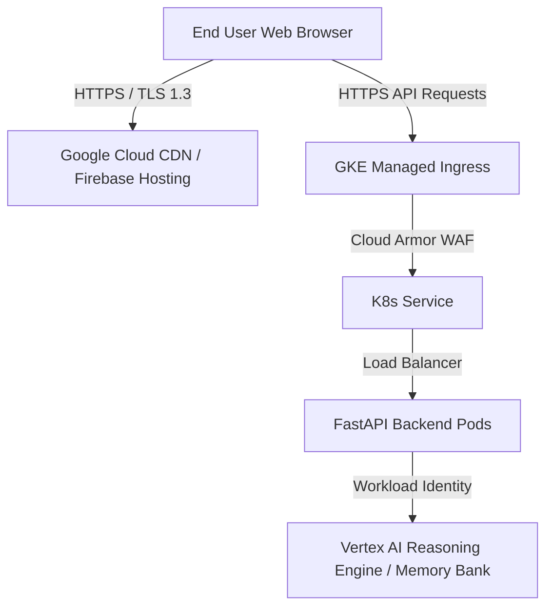

# Casper Multi-Tenant AI Platform: GKE Production Readiness Guide

This document outlines the complete architectural, deployment, and security checklist required to transition the Casper Web UI and FastAPI server from local development to an enterprise-grade, highly available, and secure production environment on **Google Kubernetes Engine (GKE)**.

---

## 1. Production Architecture Overview

In a production-ready environment, we decouple the static frontend from the stateful backend and enforce absolute network security (HTTPS/TLS) to protect user OIDC tokens in transit:



---

## 2. Checklist & Implementation Steps

| Domain | Production Requirement | Action Item | Status |
| :--- | :--- | :--- | :--- |
| **Frontend** | Secure, CDN-backed static hosting | Deploy Web UI to **Firebase Hosting** or GCS behind Cloud CDN. | 📋 TODO |
| **Networking** | Enforce HTTPS (TLS 1.3) | Map custom domain to GKE Ingress; provision Google-managed SSL. | 📋 TODO |
| **Workload Security**| Zero static credentials | Bind FastAPI pods to a GCP Service Account via **Workload Identity**. | 📋 TODO |
| **Scalability** | Horizontal Autoscaling | Configure K8s **Horizontal Pod Autoscaler (HPA)** based on CPU/Memory. | 📋 TODO |
| **Reliability** | Self-healing pods | Configure **Readiness & Liveness probes** targeting `/health`. | 📋 TODO |
| **Observability** | Alerting & Monitoring | Stream logs to Cloud Logging; set up dashboard in Cloud Monitoring. | 📋 TODO |

---

## 3. Detailed Step-by-Step Guide

### Step 1: Production Frontend Hosting (Firebase Hosting)
In production, serving the UI via `python3 -m http.server` is insecure and slow. Firebase Hosting provides edge CDN delivery, automatic SSL certificates, and natively integrates with Firebase Auth.

1.  Install the Firebase CLI:
    ```bash
    npm install -g firebase-tools
    ```
2.  Initialize Firebase Hosting in the `multi-user-session-isolation/frontend/` folder:
    ```bash
    firebase init hosting
    ```
    *   Select your project: `GCP_PROJECT_ID`.
    *   Set the public directory to `.` (current directory containing `index.html`).
    *   Configure as a single-page app: **No**.
3.  Deploy the static frontend:
    ```bash
    firebase deploy --only hosting
    ```
    *Copy the secure production URL returned (e.g., `https://GCP_PROJECT_ID.web.app`).*

---

### Step 2: Enforce HTTPS & Create GKE Ingress
User OIDC bearer tokens are highly sensitive. Sending them over plaintext `http://` makes them vulnerable to interception. You must expose the FastAPI server over secure `https://`.

1.  **Reserve a Static IP:**
    ```bash
    gcloud compute addresses create casper-backend-ip --global
    ```
2.  **Configure Managed Certificate:**
    Create `managed-cert.yaml` to request a Google-managed SSL certificate for your corporate domain:
    ```yaml
    apiVersion: networking.gke.io/v1
    kind: ManagedCertificate
    metadata:
      name: casper-ssl-cert
      namespace: namespace-a
    spec:
      domains:
        - api.casper.yourdomain.com
    ```
3.  **Define GKE Ingress with Cloud Armor:**
    Create `ingress.yaml` to route traffic securely, terminate SSL, and enable DDoS/WAF protection:
    ```yaml
    apiVersion: networking.k8s.io/v1
    kind: Ingress
    metadata:
      name: casper-ingress
      namespace: namespace-a
      annotations:
        kubernetes.io/ingress.global-static-ip-name: "casper-backend-ip"
        networking.gke.io/managed-certificates: "casper-ssl-cert"
        kubernetes.io/ingress.class: "gce"
    spec:
      defaultBackend:
        service:
          name: adk-multi-user-service
          port:
            number: 80
    spec:
      rules:
      - host: api.casper.yourdomain.com
        http:
          paths:
          - path: /*
            pathType: ImplementationSpecific
            backend:
              service:
                name: adk-multi-user-service
                port:
                  number: 80
    ```
    Apply the configuration:
    ```bash
    kubectl apply -f managed-cert.yaml
    kubectl apply -f ingress.yaml
    ```

---

### Step 3: Implement GKE Workload Identity (Zero Static Keys)
Never store service account private key JSON files inside your docker containers or Kubernetes secrets. In production, we bind the Kubernetes Service Account directly to the Google Cloud Service Account.

1.  **Create IAM Policy Binding:**
    Allow the K8s service account in `namespace-a` to act on behalf of your GCP service account:
    ```bash
    gcloud iam service-accounts add-iam-policy-binding agent-sa-a@GCP_PROJECT_ID.iam.gserviceaccount.com \
        --role="roles/iam.workloadIdentityUser" \
        --member="serviceAccount:GCP_PROJECT_ID.svc.id.goog[namespace-a/adk-multi-user-sa]"
    ```
2.  **Annotate the Kubernetes Service Account:**
    Update your Kubernetes Service Account manifest to reference the GCP Service Account:
    ```yaml
    apiVersion: v1
    kind: ServiceAccount
    metadata:
      name: adk-multi-user-sa
      namespace: namespace-a
      annotations:
        iam.gke.io/gcp-service-account: "agent-sa-a@GCP_PROJECT_ID.iam.gserviceaccount.com"
    ```
3.  Now, any pods running with `serviceAccountName: adk-multi-user-sa` will seamlessly inherit GCP IAM permissions without needing any JSON files or environment credential keys!

---

### Step 4: Pod Reliability & Resource Constraints (Self-Healing)
To ensure the backend doesn't crash from resource starvation and automatically restarts if frozen, we configure **Resource Limits** and **Probes** inside [multi-user-agent.yaml](deployment/multi-user-agent.yaml):

```yaml
spec:
  containers:
  - name: multi-user-agent
    image: us-central1-docker.pkg.dev/GCP_PROJECT_ID/agent-repository/multi-user-isolated-agent:latest
    resources:
      requests:
        memory: "512Mi"
        cpu: "500m"
      limits:
        memory: "1Gi"
        cpu: "1000m"
    livenessProbe:
      httpGet:
        path: /health
        port: 8080
      initialDelaySeconds: 15
      periodSeconds: 20
    readinessProbe:
      httpGet:
        path: /health
        port: 8080
      initialDelaySeconds: 5
      periodSeconds: 10
```

---

### Step 5: Horizontal Pod Autoscaler (HPA)
AI Reasoning Engines and LLM token processing can cause brief CPU spikes on the web server. Configure an autoscaler to scale out your backend pods horizontally when traffic spikes:

Create `hpa.yaml`:
```yaml
apiVersion: autoscaling/v2
kind: HorizontalPodAutoscaler
metadata:
  name: casper-backend-scaler
  namespace: namespace-a
spec:
  scaleTargetRef:
    apiVersion: apps/v1
    kind: Deployment
    name: adk-multi-user-agent
  minReplicas: 2
  maxReplicas: 10
  metrics:
  - type: Resource
    resource:
      name: cpu
      target:
        type: Utilization
        averageUtilization: 70
```
Apply the autoscaler:
```bash
kubectl apply -f hpa.yaml
```

---

### Step 6: Production Monitoring and Alerting
Once deployed, monitor the latency and error rates of your stateful memory backend:

1.  **Log Queries:**
    FastAPI logging outputs requests in structured format. In **Cloud Logging Log Explorer**, filter logs for quick debugging:
    ```text
    resource.type="k8s_container"
    resource.labels.namespace_name="namespace-a"
    resource.labels.container_name="multi-user-agent"
    textPayload:"Mapped to:"
    ```
2.  **Alerting Policies:**
    In **Cloud Monitoring**, create an alerting policy to notify the operations team (via Email, Slack, or PagerDuty) if:
    *   The container restart count > 0 over a 5-minute window.
    *   The HTTP 500 error rate exceeds 2% of total traffic.
    *   The `/api/chat` execution latency exceeds 5000ms.

---

By completing these steps, your Casper AI agent platform transitions into an airtight, scalable, and self-healing multi-tenant ecosystem compliant with enterprise-level security audits.
