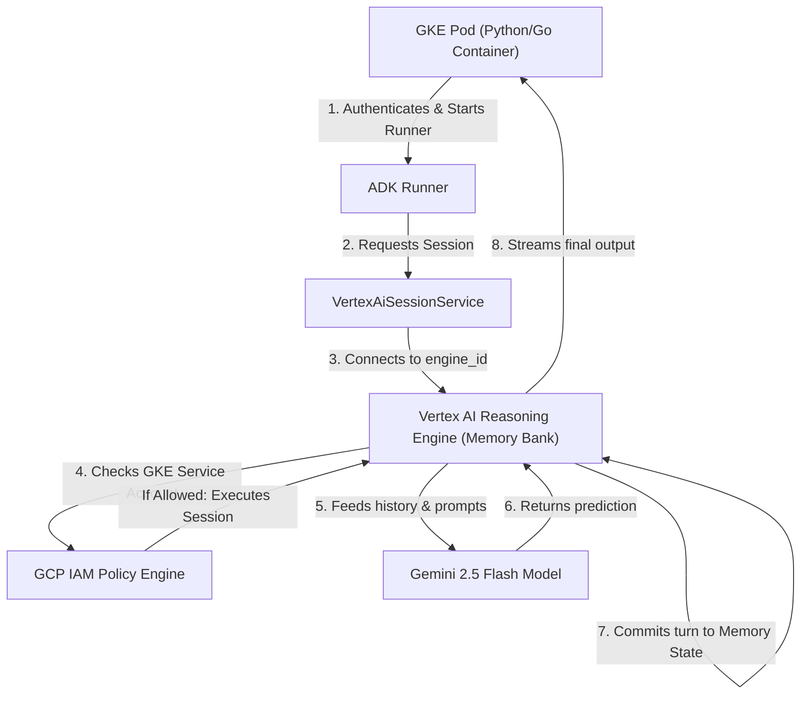

# Vertex AI Multi-Agent Security Scenarios: IAM Architecture Guide

This document details the design, configuration, and enforcement patterns for the four primary security scenarios used when architecting agents with the Vertex AI Agent Development Kit (ADK) and Stateful Memory Banks.

---

## Scenario Comparison Matrix

| Scenario | Use Case | Reasoning Engine Isolation | Memory Scope Isolation | Required Roles | CEL Condition Needed? |
| :--- | :--- | :--- | :--- | :--- | :---: |
| **Scenario A** | Administrators, developers, or global non-isolated pipelines | **Shared/Unrestricted** | **Shared/Unrestricted** | `roles/aiplatform.user` | **No** (Unconditional) |
| **Scenario B** | Basic backend services that only perform predictions / LLM generation | **None** (No engine used) | **None** (No memory used) | `roles/aiplatform.endpoints.predictUser` | **No** (Unconditional) |
| **Scenario C** | Full-isolation tenants (e.g., highly sensitive, separate client pods) | **Dedicated** (Per-agent physical resource) | **Dedicated** (Isolated logical scope) | `roles/aiplatform.user`<br>`roles/aiplatform.memoryUser` | **Yes** (Resource + Scope Lock) |
| **Scenario D** | Cost-optimized multi-tenant pods (e.g., separate users sharing one agent framework) | **Shared** (Same physical runtime engine) | **Dedicated** (Isolated logical scope) | `roles/aiplatform.user`<br>`roles/aiplatform.memoryUser` | **Yes** (Shared Engine + Scope Lock) |

---

## Detailed Scenario Walkthroughs

### Scenario A: Unrestricted/Admin Users or Non-Isolated Workloads

#### Use Case
This scenario is designed for human administrators, data scientists, backend developers, or global non-isolated pipelines (like automated CI/CD workers or monitoring services) that require global access across all platform resources without strict security boundaries.

#### IAM Configuration
Because access is unrestricted, the principal is granted standard roles at the GCP project level **unconditionally** (with no CEL conditions).

*   **Role**: `roles/aiplatform.user`
*   **Binding Target**: User email, admin service account, or developer group.

#### Why it is used
*   **Zero Overhead**: Avoids complex condition maintenance or policy space exhaustion.
*   **Complete Model Access**: Allows seamless prediction across any Model Garden publisher models (e.g., Gemini 2.5) and custom endpoints.
*   **Global Operations**: Allows listing, purging, and deleting any reasoning engine or memory bank in the project.

---

### Scenario B: Prediction-Only Workloads (No Memory Banks or Engines)

#### Use Case
Designed for basic backend applications or microservices that need to call LLMs for simple tasks (e.g., translation, summarization, entity extraction) but do not use Reasoning Engines, custom tools, or stateful Memory Banks.

#### IAM Configuration
To enforce least privilege, we bypass the wide `roles/aiplatform.user` role completely. Instead, we grant the granular, prediction-only role unconditionally.

*   **Role**: `roles/aiplatform.endpoints.predictUser`
*   **Binding Target**: Backend microservice service account.

#### Why it is used
*   **Minimized Attack Surface**: The microservice is strictly blocked from creating, reading, listing, or deleting reasoning engines, pipelines, metadata, or memory banks.
*   **No CEL Conditions Required**: Because the permission `aiplatform.endpoints.predict` is granted at the project level without conditions, the microservice can call global Gemini 2.5 publisher models unconditionally.

---

### Scenario C: Isolated Agent (Dedicated Engine + Dedicated Memory Bank)

#### Use Case
The gold standard for multi-tenant isolation (e.g., different corporate customers running their own dedicated agent workloads). Agent C must be completely cryptographically isolated from Agent A and Agent B at both the physical execution and logical database layers.

#### IAM Configuration
This scenario implements **two layers of conditional security** to lock down the principal's GCP Service Account:

#### Layer 1: Dedicated Reasoning Engine Lock
Grant the principal the `roles/aiplatform.user` role, restricted to **its own Reasoning Engine ID** and the **Model Garden prediction path**:

```yaml
# Condition Title: RestrictToAgentCEngine
expression: >
  !has(resource.name) || (has(resource.name) && (
    resource.name.startsWith('projects/GCP_PROJECT_ID/locations/us-central1/reasoningEngines/<Dedicated_Engine_ID_C>') ||
    resource.name.startsWith('projects/GCP_PROJECT_ID/locations/us-central1/publishers/')
  ))
```

#### Layer 2: Dedicated Memory Scope Lock
Grant the principal the granular `roles/aiplatform.memoryUser` role, restricted to memories matching **its own userId**:

```yaml
# Condition Title: AgentCMemoryScopeLock
expression: >
  api.getAttribute('aiplatform.googleapis.com/memoryScope', {})['userId'] == 'agent-c'
```

#### Why it is used
*   **Double-Bound Security**: Even if the container is compromised, the attacker cannot read or execute Agent A's reasoning engine (Layer 1 blocks it), nor can they read memories belonging to any other agent (Layer 2 blocks it).

---

### Scenario D: Shared Reasoning Engine with Private Logical Memory Scopes

#### Use Case
A highly cost-effective and quota-efficient multi-tenant pattern (e.g., different users or teams sharing the same core agent logic and tools, but requiring their past conversation history to remain private and completely isolated).

#### IAM Configuration
Agent D shares the same physical Reasoning Engine as Agent A (e.g., Engine ID `REASONING_ENGINE_ID_A`). However, they maintain separate, private logical memory banks.

#### Layer 1: Shared Reasoning Engine Access
Grant Agent D's service account (`agent-sa-d`) the `roles/aiplatform.user` role, but restrict it to the **shared reasoning engine** and **model prediction paths**:

```yaml
# Condition Title: RestrictToSharedEngine
expression: >
  !has(resource.name) || (has(resource.name) && (
    resource.name.startsWith('projects/GCP_PROJECT_ID/locations/us-central1/reasoningEngines/REASONING_ENGINE_ID_A') ||
    resource.name.startsWith('projects/GCP_PROJECT_ID/locations/us-central1/publishers/')
  ))
```

#### Layer 2: Isolated Memory Scope Lock (The Logical Database Boundary)
Even though the engine is shared, memories are separated at the database layer using the `memoryScope` context. Grant Agent D's service account `roles/aiplatform.memoryUser` restricted **exclusively to its own userId scope**:

```yaml
# Condition Title: AgentDMemoryScopeLock
expression: >
  api.getAttribute('aiplatform.googleapis.com/memoryScope', {})['userId'] == 'agent-d'
```

Compare this with Agent A's scope lock on the same shared engine:
```yaml
# Condition Title: AgentAMemoryScopeLock
expression: >
  api.getAttribute('aiplatform.googleapis.com/memoryScope', {})['userId'] == 'agent-a'
```

#### Why it is used
*   **Resource/Cost Efficiency**: Only one physical Reasoning Engine resource needs to be provisioned and maintained in GKE / GCP, dramatically reducing cost and avoiding quota bottlenecks.
*   **Guaranteed Logical Separation**: When the shared engine queries the memory bank on behalf of `agent-sa-d`, any attempt to retrieve sessions where `userId == 'agent-a'` is blocked by GCP IAM, resulting in an immediate `403 Permission Denied`. State isolation is completely preserved at the cloud boundary.

---

## Stateful Architecture & Data Flow

To understand where IAM policies are evaluated, the following architecture diagram outlines how a request moves from a GKE-hosted container pod to the stateful Vertex AI Reasoning Engine and Model Garden:



### Flow Breakdown:

1.  **Workload Identity Authentication**: The GKE container begins execution and leverages Workload Identity to obtain an OAuth token matching its assigned GCP Service Account (e.g., `agent-sa-a`).
2.  **Initialization**: The ADK `Runner` initializes and calls the `VertexAiSessionService` pointing to the Reasoning Engine/Memory Bank path.
3.  **Connection**: The connection request travels to the Vertex AI endpoints.
4.  **IAM Policy Gate**: Before the session can be established, the **GCP IAM Policy Engine** intercepts the call.
    *   It evaluates the principal's permission against our **Layer 1** conditional policy on `roles/aiplatform.user`.
    *   If the call targets a Reasoning Engine, IAM evaluates the condition: `resource.name.startsWith('projects/.../reasoningEngines/<ENGINE_ID>')`.
    *   If the call is an LLM inference/prediction, IAM evaluates: `resource.name.startsWith('projects/.../publishers/')` or allows it if `resource.name` is absent.
5.  **State and Context Injection**: Once authorized, the Reasoning Engine pulls past context, memory, and conversation history from the **Stateful Memory Bank**. It bundles this context with the user's new prompt.
6.  **Model Inference**: The Reasoning Engine executes predictions on `gemini-2.5-flash`.
7.  **Auto-Save & State Commit**: When Gemini returns the prediction, the Reasoning Engine writes and commits the updated conversation turn, natural language memories, and metadata back to the Memory Bank.
    *   This database write is evaluated against **Layer 2** memory scope conditions (`roles/aiplatform.memoryUser`), ensuring no agent can commit data to a scope other than its own assigned ID.
8.  **Streaming Output**: The generated response streams back through the ADK Session Service directly to the GKE container logs.

